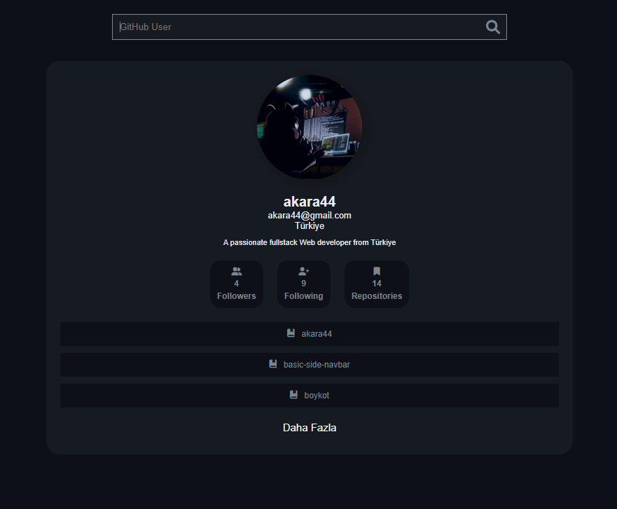

# GİTaPİ
# EXTRACTING PROFILE INFORMATION WITH GITHUB API
-I rebuilt a project that was previously done with js using PHP's Curl structure. I used Github's own apis in the project. Thanks to the project, we can view the profile information and repos of the user whose GitHub username is entered.
- You can use the project for all purposes..<br> <br> <br>
 <br> <br>


# Data Extraction with Curl
With the php codes given below, I showed how to print the data we read from the JSON source and how I pulled it.
- Extracting data with Curl:
```php
 if ($_SERVER["REQUEST_METHOD"] == "POST") {
        // Kullanıcı adını formdan alın
        $user = htmlspecialchars($_POST['user']);
        $api_url = "https://api.github.com/users/$user";
        $api_urlr = "https://api.github.com/users/$user/repos";

        // cURL oturumunu başlatın
        $mh = curl_multi_init();

        // cURL handler oluşturun
        $ch1 = curl_init();
        $ch2 = curl_init();

        // cURL seçeneklerini ayarlayın
        curl_setopt($ch1, CURLOPT_URL, $api_url);
        curl_setopt($ch1, CURLOPT_RETURNTRANSFER, 1);
        curl_setopt($ch1, CURLOPT_USERAGENT, 'PHP');

        curl_setopt($ch2, CURLOPT_URL, $api_urlr);
        curl_setopt($ch2, CURLOPT_RETURNTRANSFER, 1);
        curl_setopt($ch2, CURLOPT_USERAGENT, 'PHP');

        // cURL handler'larını multi handle'a ekleyin
        curl_multi_add_handle($mh, $ch1);
        curl_multi_add_handle($mh, $ch2);

        // cURL işlemlerini çalıştırın
        do {
            $status = curl_multi_exec($mh, $active);
            curl_multi_select($mh);
        } while ($active && $status == CURLM_OK);

        // Sonuçları alın
        $response = curl_multi_getcontent($ch1);
        $response_repos = curl_multi_getcontent($ch2);

        // HTTP durum kodlarını kontrol edin
        $http_code = curl_getinfo($ch1, CURLINFO_HTTP_CODE);
        $http_code_repos = curl_getinfo($ch2, CURLINFO_HTTP_CODE);

        // cURL handler'larını kapatın
        curl_multi_remove_handle($mh, $ch1);
        curl_multi_remove_handle($mh, $ch2);
        curl_multi_close($mh);

        if ($http_code == 200 && $http_code_repos == 200) {
            // JSON verisini PHP nesnesine dönüştürün
            $data = json_decode($response);
            $repos = json_decode($response_repos);

            if ($data):
```
- Displaying data:
```php
<li>
                            <i class="fa-solid fa-user-group"></i> <?= $data->followers ?>
                            <strong>Followers</strong>
                        </li>
```

- You can do the same for other data.
- I hope it was an easy and understandable explanation. I hope it will meet your needs.
